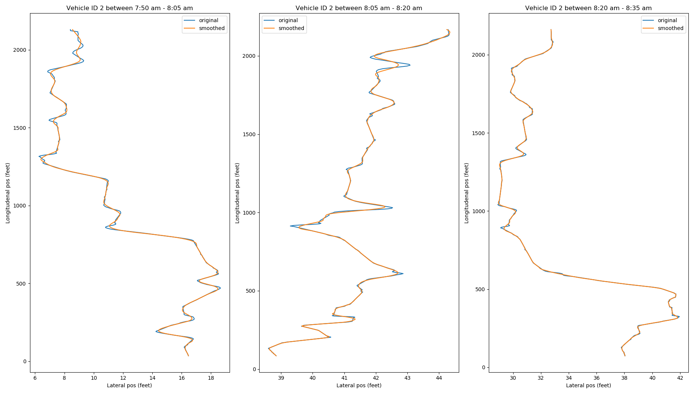

# Smoothed Dataset

### Description
Here you can find the smoothed dataset in CSV format. We provide two version of the smoothed dataset. Each is smoothed using a different smoothing window. The Savitzky-Golay filter requires a **smoothing window** which dictates the number of points used to smooth a current data point. 

### Table of Content

1. [Description](#Description)
2. [Smoothing Window](#File-Structure)
3. [Folder Structure](#Folder-Structure)
4. [File Structure](#Smoothing-Window)

### Smoothing Window
We use separately a window of 11 and 21. We specifically chose 11 and 21 because they represent, respectively, 10 and 20 data points excluding the target data point. This in trun corresponds, respectively, to 1 second and 2 seconds of trajectory data respectively. In other words, we use the trajectory data of 1 seconds and 2 seconds to smooth the data. Both datasets can be found in the folder window-11 and window-12 respectively.

**NOTE.** the filter is applied to the Local_X and Local_Y and not the Global_X and Global_Y values since they are based on the california state plane coordinate system.

 Smothing window 11 

 Smothing window 21 

### Folder Structure
Each folder contains three files:

1. 0750_0805_us101_smoothed_*_.zip
2. 0805_0820_us101_smoothed_*_.zip
3. 0820_0835_us101_smoothed_*_.zip 

where * is the value set for the smoothing window. Each file contains all the smoothed vehicle trajectories for the following times respectively 7:50 am - 8:05 am, 8:05 am - 8:20 am, 8:20 am - 8:35 am
 

### File Structure 

Each file is structured in CSV format i.e. in comma separated values. The columns are ordered in the same manner as the original non-smoothed dataset. Nevertheless for reference and ease of use we rewrite the description of the original dataset here. Each column is described in order of appearance:

* **Vehicle_ID** Vehicle identification number 
* **Frame_ID** Frame Identification number 
* **Total_Frames** Total number of frames in which the vehicle appears in this data set
* **Global_Time** Elapsed time in milliseconds since Jan 1, 1970.
* **Local_X Lateral** (X) coordinate of the front center of the vehicle in feet with respect to the left-most edge of the section in the direction of travel
* **Local_Y** Longitudinal (Y) coordinate of the front center of the vehicle in feet with respect to the entry edge of the section in the direction of travel
* **Global_X** of the front center of the vehicle in feet based on the coordinate CA State Plane III in NAD83
* **Global_Y** Y Coordinate of the front center of the vehicle in feet based on the coordinate CA State Plane III in NAD83
* **v_Length** Length of vehicle in feet
* **v_Width** Width of vehicle in feet
* **v_Class** Vehicle type: 1 - motorcycle, 2 - auto, 3 - truck
* **v_Vel** Instantaneous velocity of vehicle in feet/second
* **v_Acc** Instantaneous acceleration of vehicle in feet/second square
* **Lane_ID** Current lane position of vehicle. Lane 1 is farthest left lane; lane 5 is farthest right lane. Lane 6 is the auxiliary lane between Ventura Boulevard on-ramp and the Cahuenga Boulevard off-ramp. Lane 7 is the on-ramp at Ventura Boulevard, and Lane 8 is the off-ramp at Cahuenga Boulevard
* **Preceding** Vehicle ID of the lead vehicle in the same lane. A value of '0' represents no preceding vehicle - occurs at the end of the study section and off-ramp due to the fact that only complete trajectories were recorded by this data collection effort 
* **Following** Vehicle ID of the vehicle following the subject vehicle in the same lane. A value of '0' represents no following vehicle - occurs at the beginning of the study section and on ramp due to the fact that only complete trajectories were recorded by this data collection effort
* **Space_Headway** Space Headway in feet. Spacing provides the distance between the front-center of a vehicle to the front-center of the preceding vehicle.
* **Time_Headway** Time Headway provides the time in seconds needed to travel from the front-center of a vehicle (at the speed of the vehicle) to the front-center of the preceding vehicle. A headway value of 9999.99 means that the vehicle is traveling at zero speed (congested conditions).

